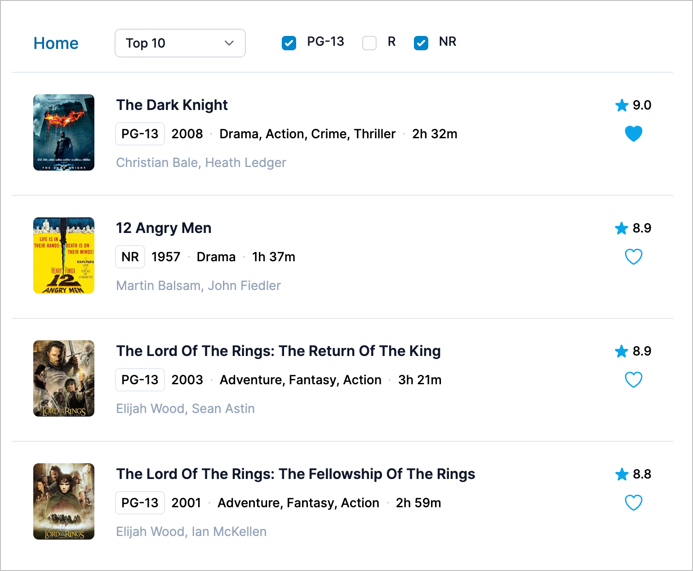

# Next.js 13 Rendering Concepts

> This repository was bootstrapped with [Code Shaper](https://code-shaper.dev).

This application is intended to clarify Next.js 13 (and React 18) rendering
concepts.

### Live Demos

- Next.js 13: https://next13-rendering-concepts-movie-magic.vercel.app/
- React/Vite: https://react-rendering-concepts-movie-magic.vercel.app/

Note that I am intentionally staying away from terms like CSR and SSR, SPAs and
MPAs, as these terms come with lots of assumptions and baggage. For example, in
Next.js 13, a client component does not automatically imply client-side
rendering (CSR). During the initial page load, a client component is rendered to
a static HTML preview on the server so that the user can see the content of the
page immediately, without having to wait for the JavaScript bundle to download.
On subsequent navigations to this page, client components are rendered entirely
on the client, without the server-rendered HTML.

## Server Components

Server components are **always** rendered on the server. There are three subsets
of server rendering: Static, Dynamic, and Streaming.

1.  **Static Rendering**: Routes are rendered at **build time**, and the result
    is cached. This optimization allows you to share the result of the rendering
    work between users and server requests.
2.  **Dynamic Rendering**: Routes are rendered at **request time**. This is
    useful when a route has data that is personalized to the user or has
    information that can only be known at request time, such as cookies or the
    URL's search params.
3.  **Streaming**: Routes are rendered at **request time**, and the work is
    split into chunks and streamed to the client as it becomes ready. This
    allows the user to see a preview of the page before it is fully rendered.

## Client Components

Client components allow us to write interactive UI that can be rendered on the
client at request time. During the initial page load, a client component is
rendered to a static HTML preview on the server so that the user can see the
content of the page immediately, without having to wait for the JavaScript
bundle to download. On subsequent navigations to this page, client components
are rendered entirely on the client, without the server-rendered HTML.

## Movie Magic – A Realistic Example

This is a realistic example implemented in two ways to show the performance
benefits of React 18 and Next.js:

1. Movie Magic CSR: This version uses Client-Side Rendering (CSR), which is the
   old way (pre React 18)
2. Movie Magic RSC: This version uses React Server Components for data fetching,
   and React Client Components for interactivity.



## Prerequisites for development

1. [Node Version Manager](https://github.com/nvm-sh/nvm) (nvm) - allows using
   different versions of node via the command line

## Getting Started

Run this application in prod mode to observe its real behavior in production.
You can run it in dev mode but the observations may be a bit confusing.

We will run the Movie Magic API in a local Express server so that we can observe
when the API's are called to fetch data vs. getting data from the application
cache. To do this, change `apps/movie-magic/.env` as follows:

```
API_URL=http://localhost:8080
NEXT_PUBLIC_API_URL=http://localhost:8080
```

Now execute the following commands in the repo's root directory:

```shell
nvm use   # use the required version of node
npm ci    # install dependencies

# Build and start the API server
npm run build --workspace=@movie-magic/movie-magic-api
npm start --workspace=@movie-magic/movie-magic-api
```

Open a new shell to build and start the Next.js application. Execute the
following commands:

```shell
nvm use
npm run build --workspace=@movie-magic/movie-magic
npm start --workspace=@movie-magic/movie-magic
```

### Optional steps to build the Vite app (traditional CSR)

Open a new shell to build and start the Vite application. Execute the following
commands:

```shell
nvm use
npm run build --workspace=@movie-magic/movie-magic-vite
npm run preview --workspace=@movie-magic/movie-magic-vite
```

> Note: Do not run `npm install` or `npm ci` in any of the subdirectories. It
> will break the build. There should be only one `package-lock.json` file in the
> entire repo (at the root).

## All Commands

```
npm ci                   # install dependencies
npm run build            # builds all workspaces
npm run ci-validate      # builds, lints, formats, and tests all code (runs in CI pipeline, don't run locally)
npm run clean            # deletes all build artifacts
npm run commit           # displays commit helper prompt to ensure your commits use conventional commits
npm run dev              # run demo app
npm run fix              # lints, formats and attempts to fix any issues (requires `npm run build` has been ran)
npm run format           # formats all workspaces, useful for debugging format issues (generally `npm run fix` is preferred)
npm run lint             # runs the linter on all workspaces, useful for debugging lint issues (generally `npm run fix` is preferred)
npm run test             # runs full build, lint, format, and all tests - run before pushing to remote
```

### Dev build

To build all packages and apps for production, run the following command:

```shell
nvm use
npm ci
npm run dev
```

### Production build

To build all packages and apps for production, run the following command:

```shell
nvm use
npm ci
npm run build
```

### Clean build

Removes all build artifacts and performs a clean build.

```shell
npm run clean
npm ci
npm run dev
```

For an "aggressive" clean build, add one more step as shown below. This will
build the lock file from scratch.

```shell
npm run clean
rm package-lock.json
npm install
npm run dev
```

### Running unit tests

The following command runs a full build, lint, format, and all tests. However,
it uses the Turborepo cache to skip steps that have no changes since the last
run. Hence it is very efficient. **Always run this command before pushing to
remote.**

```shell
npm test
```

### Running end-to-end tests using dev build

```shell
npm run dev # starts a local server hosting the react app

# run e2e tests non-interactively (run in a different shell)
npm run e2e

# run e2e tests in the Playwright user interface (run in a different shell)
npm run e2e:ui
```

### Linting, formatting and fixing coding issues

```shell
npm run fix
```
